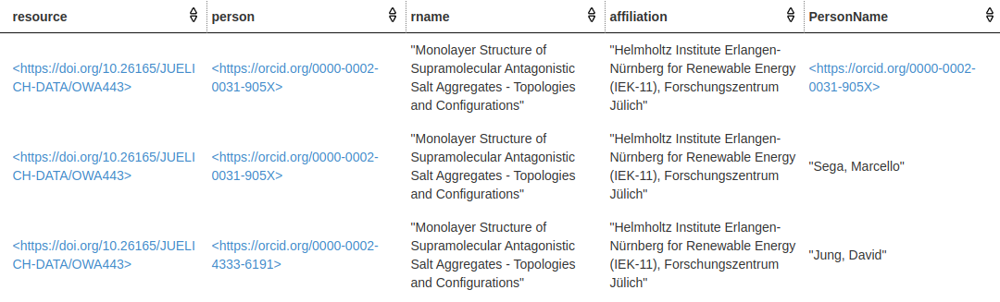
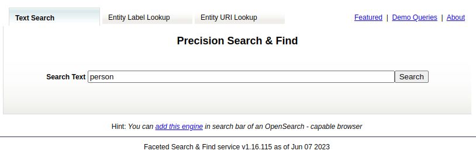
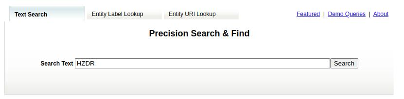
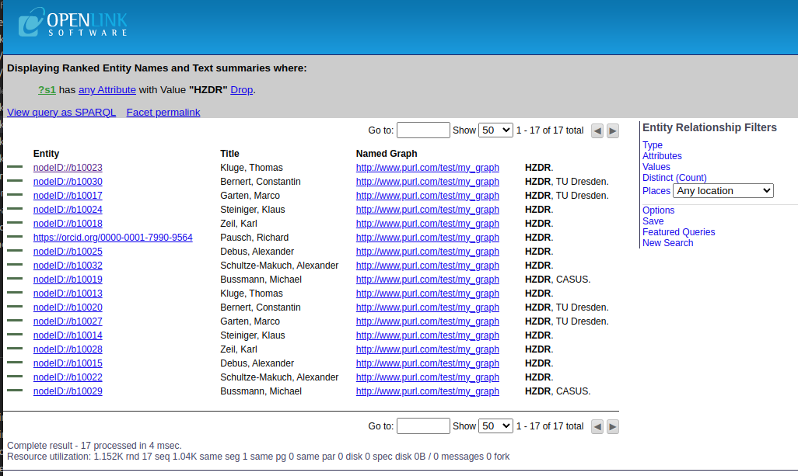
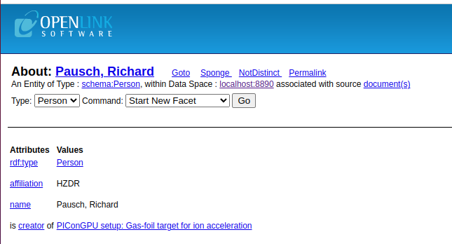
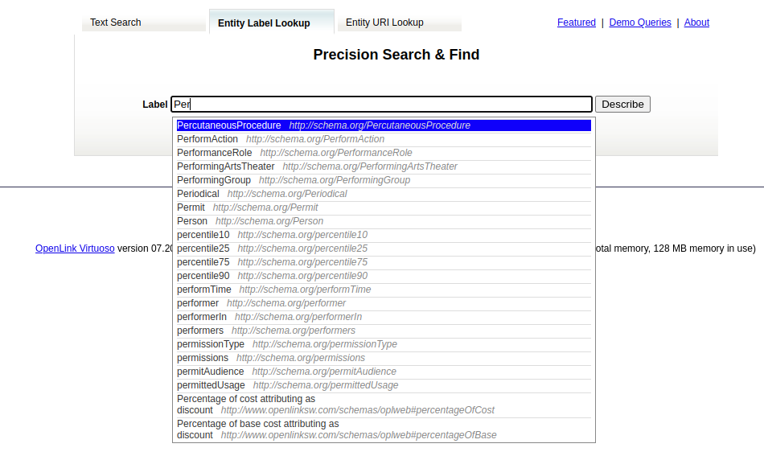
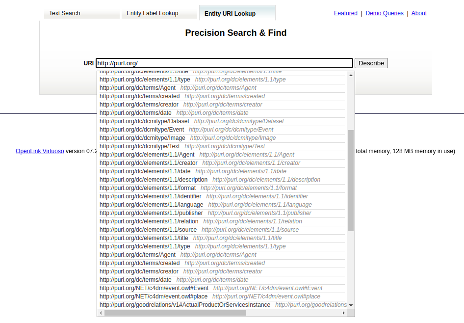

# SPARQL endpoint

UnHIDE exposes the full public part of the graph through a read only SPARQL endpoint:
currently available under https://sparql.unhide.helmholtz-metadaten.de/sparql/ but in the future mainly under https://sparql.unhide.helmholtz-metadaten.de/.

<p style="text-align: center;"> </p> 


UNHIDE runs a [Virtuoso SPARQL](https://vos.openlinksw.com/owiki/wiki/VOS/VOSSPARQL) Endpoint which could be used to query the unHIDE knowledge graph using the [SPARQL Query Language](https://www.w3.org/TR/sparql11-query/) — a W3C open standard which can be used to express queries across diverse data sources, whether the data is stored natively as RDF. 

The server is running as part of the larger deployment of unHIDE, as a part of the Docker compose file. 

 
<!-- 
-->

## SPARQL Query Language

SPARQL queries [RDF](https://www.w3.org/RDF/) graphs, which is comprises a set of semantic triple, or RDF triple or simply triple. A triple is a set of three entities that constitutes a statement about semantic data in the form of subject–predicate–object statements (e.g., "DatasetX has license CC BY 4.0").
The importance lies in the triples, not the serialization. Serialization is just a way to write the triples down.

SPARQL allows for a query to consist of triple patterns, conjunctions, disjunctions, and optional patterns as well as to perform changes on data via SPARQL updates.  It also supports aggregation, subqueries, negation, creating values by expressions, extensible value testing, and constraining queries by source RDF graph. The results of SPARQL queries can be result sets or RDF graphs.

### Syntax

Before writing a SPARQL query it is important to define the namespace prefix bindings which are used int he query. A binging is a pair of a prefix name and the corresponting IRI. For instance, the following is a binding for `schema` and `rdfs` namespaces:
```
PREFIX schema: <http://schema.org/>
PREFIX rdfs: <http://www.w3.org/2000/01/rdf-schema#>
```
Most forms of SPARQL query contain a set of triple patterns called a basic graph pattern. Triple patterns are like RDF triples except that each of the subject, predicate and object may be a variable. A basic graph pattern matches a subgraph of the RDF data when RDF terms from that subgraph may be substituted for the variables and the result is RDF graph equivalent to the subgraph.

### Examples
The example below demonstrates a simple query that leverages the publicatoins along with their authors. Specifically, the following query returns names and affiliation of every person participated in the creation of that resource:
```
PREFIX schema: <http://schema.org/>
SELECT *
WHERE {
  ?resource    schema:creator         ?person.
  ?resource    schema:name            ?rname.
  ?person      schema:affiliation     ?affiliation. 
  ?person      schema:name            ?PersonName
}
```
The results will look like:



## Virtuoso SPARQL Endpoint

[Virtuoso universal server](https://docs.openlinksw.com/virtuoso/) provides the [SPARQL 1.1 protocols](http://www.w3.org/TR/sparql11-protocol/) for query and update as well as the SPARQL Graph Store protocol. Virtuoso reserves the path `/sparql/` and a synonym path `/SPARQL/` for SPARQL service.  Virtuoso’s built-in SPARQL Query Service functionality delivers a variety of capabilities:
- Supports the HTTP-based SPARQL Query Service Protocol
- Supports Federated SPARQL (i.e. supports `SERVICE` clause that identifies an external SPARQL endpoint upon which to execute a sub-query — as one option for executing federated queries over SPARQL endpoints from the [LOD Cloud](https://lod-cloud.net/).
- Supports optional de-referencing of variables and constants in the body of a query, thereby incorporating content crawling over external data sources into the query solution production pipeline.
- Support for a variety of query types including CONSTRUCT, ASK, DESCRIBE.
- Supports a wide variety of query solution document types including (among others) HTML, CSV, JSON, and XML for SELECT Queries, and RDF-Turtle, RDF-N-Triples, JSON-LD, and RDF-XML for DESCRIBE and CONSTRUCT Queries.
- Includes a query optimaization service that produces the SPARQL query after parsing, optimization and converting back into SPARQL.
- Adds Extract, Transform, and Load operations to the query solution production pipeline through built-in integration with Virtuoso RDF Transformation Middleware (or [RDFizer](https://github.com/SDM-TIB/SDM-RDFizer)), commonly referred to as the Sponger — which also includes cache invalidation functionality.
- Supports HTTP Content Negotiation ("conneg"), both Basic and Dynamic via QoS algorithms.
- Also exploitable by ODBC, JDBC, ADO.NET, OLE DB, and XMLA applications as an open standards-based extension to SQL.


### Virtuoso SPARQL Query Service

Both `GET` and `POST` requests are supported by both server and client. The server recognizes the `Accept:` line of the request header to find MIME types preferred by the connected client and adjust the output mode of the response. The client chooses between GET and POST automatically, based on the length of the query text. More information can be found [here](https://vos.openlinksw.com/owiki/wiki/VOS/VOSSparqlProtocol).

### Virtuoso Facet Browser 

The Virtuoso Facet Browser UI allows users to save Faceted View and iSPARQL queries as "Featured" queries for future reference.




Use the Faceted Browser Search to search for information on "HZDR":



Results of the following form should be returned for the resource being fetched:



where users can find all entities that are related to `HZDR` and their title, type, etc. Below is an example of one of these entities:



Additionally, users can export these results in various formats, including csv, HTML, RDF (N-triples), RDF (turtule), etc. 
Here is the results exported as RDF/XML:

```xml
<?xml version="1.0" encoding="utf-8" ?>
<rdf:RDF
	xmlns:rdf="http://www.w3.org/1999/02/22-rdf-syntax-ns#"
	xmlns:rdfs="http://www.w3.org/2000/01/rdf-schema#"
	xmlns:schema="http://schema.org/" >
  <rdf:Description rdf:about="https://orcid.org/0000-0001-7990-9564">
    <rdf:type rdf:resource="http://schema.org/Person" />
    <schema:affiliation>HZDR</schema:affiliation>
    <schema:name>Pausch, Richard</schema:name>
  </rdf:Description>
</rdf:RDF>
```

**Entity Label Lookup** tab: In the Label auto-complete text box of the Entity Label Lookup tab, enter the name of an rdfs label to be Described, then select a URI from the list of available Labels to obtain a description of the URI.





**Entity URI Lookup** tab: In the URI auto-complete text box of the Entity URI Lookup tab enter the name URI to be Described, then select a URI from the list of available Labels to obtain a description of the URI.




