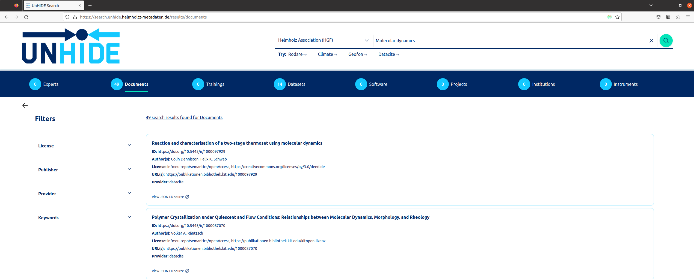
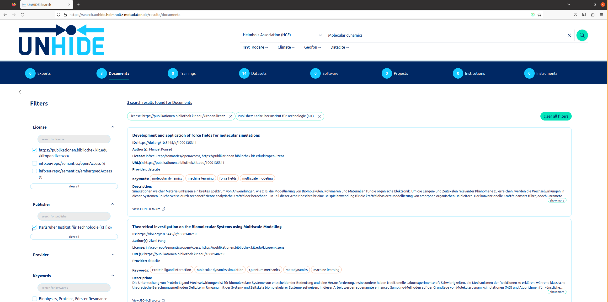

# Web front end

Data indexed in unHIDE is also exposed via a user-friendly web-based application powered by React, at:
https://search.unhide.helmholtz-metadaten.de/

This web application allows for federated text search through metadata from all data providers.
Basic refinement of searches through suggested filters and data categories is possible.

For example, a user could search for 'Molecular dynamics' to find related Datasets and other resources.

The results of any search can be narrowed further with the dynamic filters made available to the user alongside the results of any search. As the dynamic filters are based on the results of the search, their availability is entirely dependent on the results of the search. 

Continuing with the example above, you will see the Documents found while searching for 'Molecular dynamics' have been filtered further to get to the required results.

