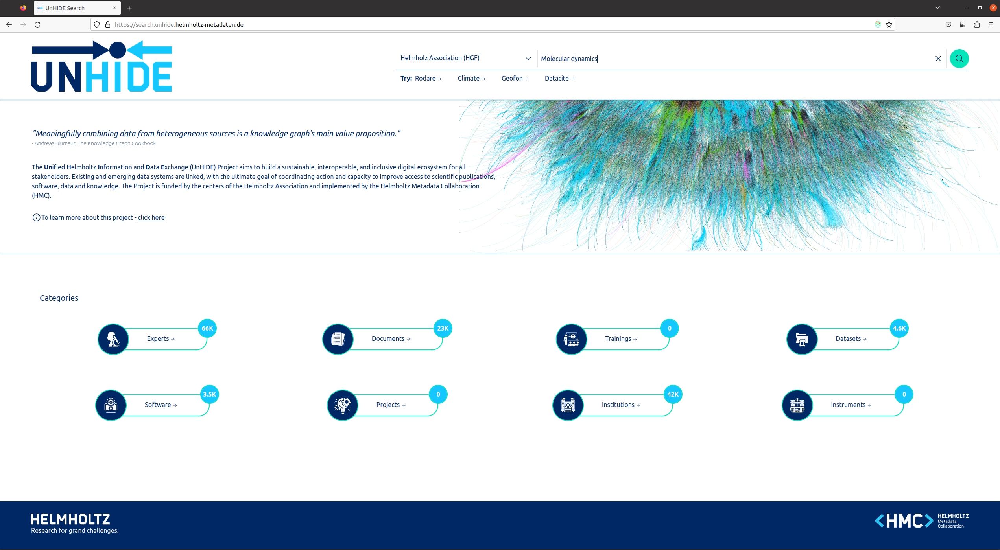
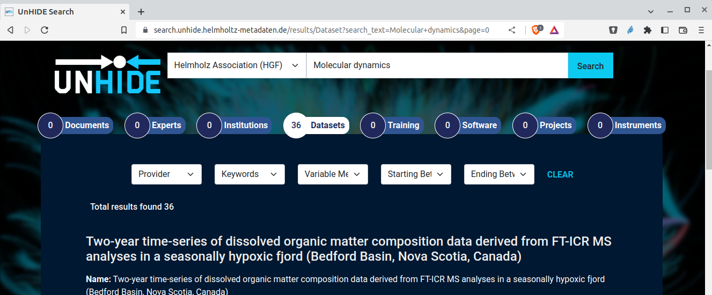

# Web front end

Indexed data in UnHIDE is also exposed in a human friendly way through a reacted based web front end:
https://search.unhide.helmholtz-metadaten.de/

This front end allows for federated text search through metadata from all data providers.
Basic refinement of searches through suggested filters and data categories is possible.

For example a user could search for 'Molecular dynamics' finding related Datasets and other resources.

