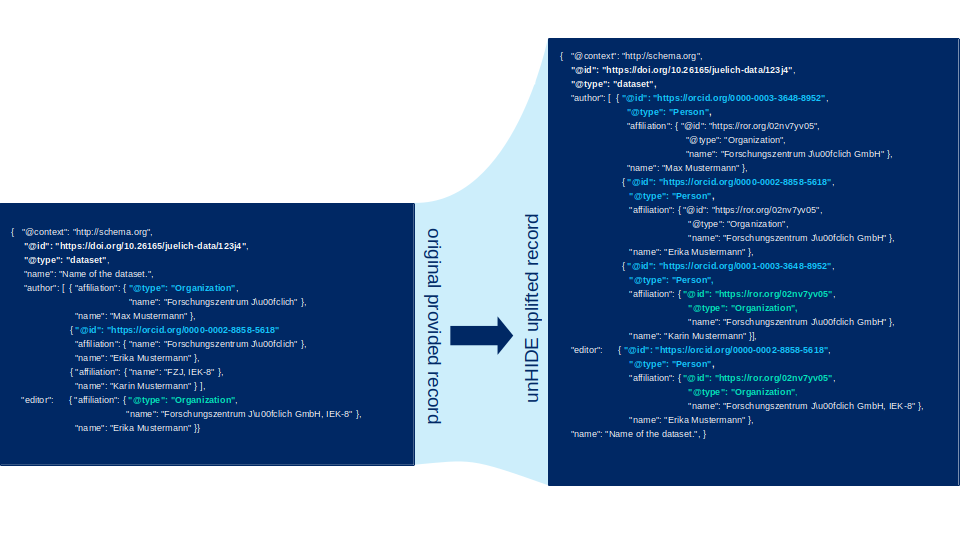
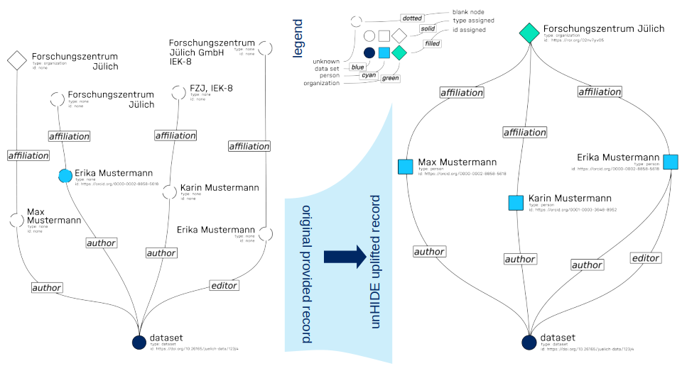

# Uplifted data records

One purpose of UnHIDE is to check and improve on the quality of the metadata.
Since the metadata is often feed into the system via different interfaces that humans fill per hand,
the quality of the semantic annotation of the metadata records is often lacking, heterogeneous and messy. Also small subtrees of metadata have
to be cut off and left quite minimal.

A first improvement or uplifted of the metadata can be done on rules implied by the semantics, like the inference of types.
By accumulating the metadata across the Helmholtz Association into a single graph, allows us to combine and complete subgraphs of certain entities and provides these more complete subgraphs back to providers.
This allows for general harmonization, resolving entities and assigning IDs.

An example of what this means in practice for a toy metadata record is shown in the Figures below.

On the graph perspective the impact of the changes become clear. The connectivity of the graph increased while the number of nodes without an ID and types decreased. Such changes are even more profound on larger scales when data records are combined.
